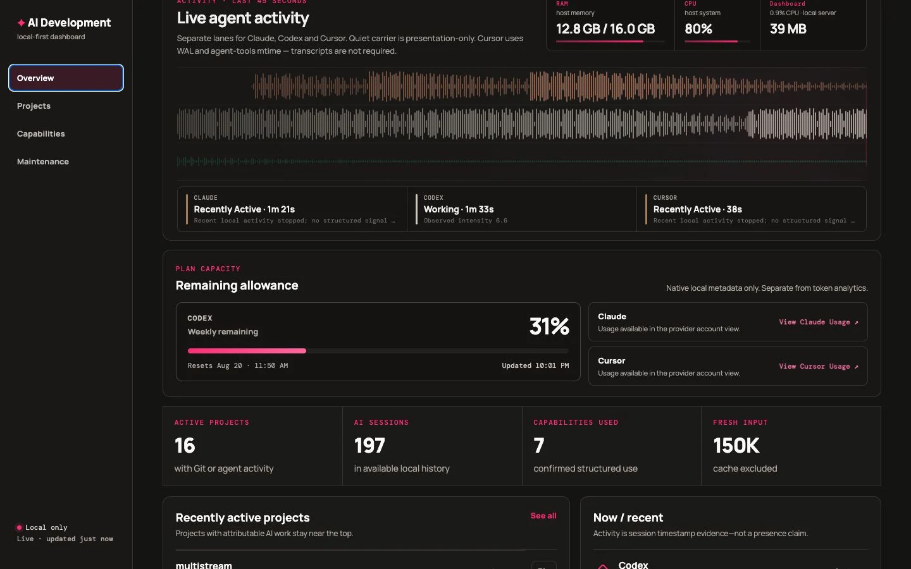
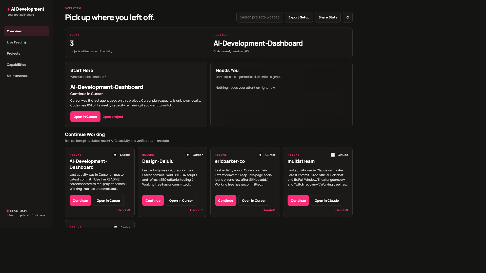
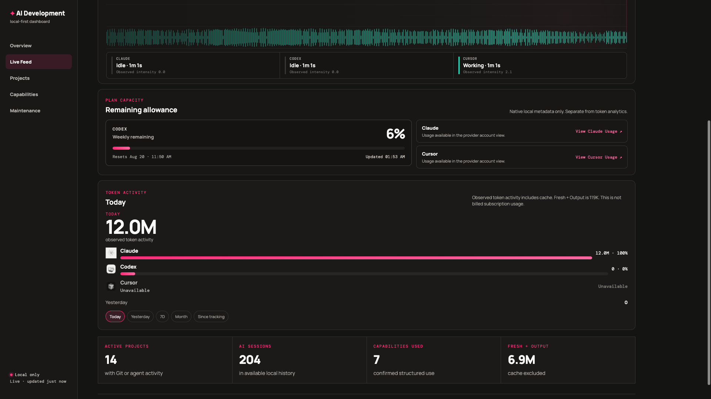

# AI Development Dashboard

A local-first, project-first operating layer for developers working across multiple AI coding agents.

It watches the Git projects on your machine and the local Claude, Codex, and Cursor records around them, then helps you resume work, see live activity, and keep an honest inventory of capabilities. It can observe several agents and future harnesses without becoming an execution harness.

> Private beta: the GitHub repository is private. This is not a hosted service.







## Why it exists

Modern development is often spread across more than one AI tool. Provider dashboards start with a vendor. Skill managers start with a folder. Token trackers start with usage. This dashboard starts with the **project**, then attaches agents, hosts, models, sessions, capabilities, and observable activity.

It is not a token tracker, not a multi-agent harness, and not a skill installer. It remains the operating and analytics layer around projects.

## Start

Requires Node 20+ and Git. Works on macOS first; the server binds only to loopback.

```bash
git clone <repository-url>
cd AI-Development-Dashboard
npm install
npm start
```

Open `http://127.0.0.1:4177`. On first run, choose the local folder that holds your Git projects. Dropbox is not required.

You can also set:

- `AI_DASHBOARD_PROJECTS_ROOT` — one path
- `AI_DASHBOARD_PROJECTS_ROOTS` — colon- or comma-separated paths
- `projectsRoots` in `.dashboard-data/settings.json`

If `~/Dropbox/Projects` or `~/Projects` already exists, it is detected. Otherwise the Overview asks for a folder, then scans.

`npm run scan` builds the index without serving. `npm test` runs the deterministic suite.

The repository command is also package-ready:

```bash
npm run dashboard -- open
npm run dashboard -- status
npm run dashboard -- stop
npm run dashboard -- doctor
```

`setup` opens the same local onboarding flow; `update`, `uninstall`, and `autostart` are safe Phase 1 previews only. No package is published and start-at-login remains off.

## What it does

### Overview

Pick up where you left off: Today, Start Here, Needs You, Continue Working, and project handoff / open-in-agent actions.

### Live Feed

Ambient telemetry: live lanes for observed runtimes, current agent states, plan capacity, RAM/CPU/dashboard footprint, and token activity for the selected range (Today / Yesterday / 7 days / This month / Since tracking began).

### Projects, Capabilities, Maintenance

Canonical Git projects, a capability registry, and conservative maintenance signals. The dashboard does not install or remove skills.

## Truth model

**Measured** means direct filesystem/Git/transcript metadata. **Confirmed** session attribution uses a recorded working directory below a discovered Git root. **Strongly inferred** identifies Cursor project folders with an encoded project path. **Unknown** stays unknown.

Agent, host, provider, model, and optional task role are separate fields. VS Code is an editor host, not an AI agent. Historical VS Code AI usage is unknown unless a trustworthy source exists.

The dashboard never shows invented Claude/Cursor subscription quota, subscription billing, or productivity scores. Token values are observable usage fields, not charges.

## Token language

| Label | Meaning |
| --- | --- |
| Fresh Input | New input tokens, cache excluded |
| Output | Output tokens |
| Cache Read | Previously cached context read |
| Cache Creation | Context written to cache |
| Observed token activity | Sum of observed categories, including cache |
| Fresh + Output | Fresh input plus output only |

Cursor **local token telemetry** may be exact (context meter / rare non-zero bubble counts), estimated (documented character fallback when current Cursor builds store `{0,0}`), or **unavailable**. Cursor itself still shows usage in the Cursor account dashboard. A zero never means “this provider used nothing” when the source cannot expose tokens. Official Usage CSV import is a documented future option, not required now.

## Privacy

The Local Core makes no network requests: scanning, the localhost server, and local views remain offline. Connected Services are optional and make requests only after explicit connection to the selected provider. OpenRouter Phase 2A uses an `OPENROUTER_MANAGEMENT_KEY` supplied to the dashboard process; only aggregate analytics metadata/usage and credits are requested, never prompts, code, or transcripts. `.dashboard-data/` is local and gitignored; it stores an opaque credential reference, never a key. Share Story uses a separate allowlisted snapshot. Details: [PRIVACY.md](PRIVACY.md), [docs/SHARING-PRIVACY.md](docs/SHARING-PRIVACY.md).

## Supported local sources

| Source | What is observed | Important limits |
| --- | --- | --- |
| Claude Code | Session metadata, supported token fields, structured skill attribution, live session-file activity | No supported local subscription percentage. A Kimi/DeepSeek model ID in those files is recorded as a different provider/model, not collapsed into “Claude tokens.” |
| Codex CLI | Session metadata, working-directory attribution, native weekly remaining %, live session-file activity | Token categories depend on what local records expose. |
| Cursor | Safe session presence, encoded project attribution, live WAL/`agent-tools` mtime, local token evidence when safe fields exist | Exact, Estimated, Mixed, or Unavailable depending on the local record. Cursor still tracks usage in its own account dashboard. Transcript files are often empty while an agent is working. |
| Git | Repository identity and descriptive change activity | LOC and churn are descriptive, not productivity scores. |
| VS Code | Installed AI-related extensions only | Not counted as AI activity. |
| OpenRouter (optional Connected Service) | Provider-reported aggregate analytics, credits, observed models/providers | Disabled by default; manual sync only; no project attribution without an explicit future mapping. |
| Antigravity | Closed app/CLI/root detection; optional documented CLI status-line snapshots | App/root presence never claims history or live work. The optional local bridge captures current model/context and quota buckets only after explicit preview and confirmation. |

The private **Efficiency** workspace is an evidence-readiness surface, not a productivity score. It shows structural observations by model and labels measured, inferred, and user-confirmed evidence separately. Work blocks are currently session proxies; the dashboard does not rank models or claim capability/model causation.

## Limitations

Not reliable yet: completed-task attribution, accepted changes, rework/reverts, Claude/Cursor plan remaining, third-party update availability, automated capability modification, and API cost as a stand-in for subscription savings. Cursor local token evidence is supported only when its safe local records expose it and is always labelled Exact, Estimated, Mixed, or Unavailable.

Orchestration of multiple workers is **not** this product’s runtime. The index can represent a harness run so a future adapter can feed telemetry. See [docs/ORCHESTRATION.md](docs/ORCHESTRATION.md).

## Public-release status

MIT licensed ([LICENSE](LICENSE)). The GitHub repository is still private; enabling the in-app Source code footer link is a settings flag after the repository is made public. See [PRIVACY.md](PRIVACY.md), [SECURITY.md](SECURITY.md), [CONTRIBUTING.md](CONTRIBUTING.md), and the checklist: [docs/RELEASE-CHECKLIST.md](docs/RELEASE-CHECKLIST.md).

## Development

```bash
npm test
npm run scan
npm start
```

See [environment audit](docs/ENVIRONMENT-AUDIT.md), [architecture](docs/ARCHITECTURE.md), [metrics](docs/METRICS.md), [telemetry sources](docs/TELEMETRY.md), [model economics](docs/MODEL-ECONOMICS.md), [sharing privacy](docs/SHARING-PRIVACY.md), [future benchmarks](docs/FUTURE-BENCHMARKS.md) and [reuse decisions](docs/REUSE-DECISIONS.md).

## License

[MIT](LICENSE) © 2026 Eric Barker / Design Delulu
