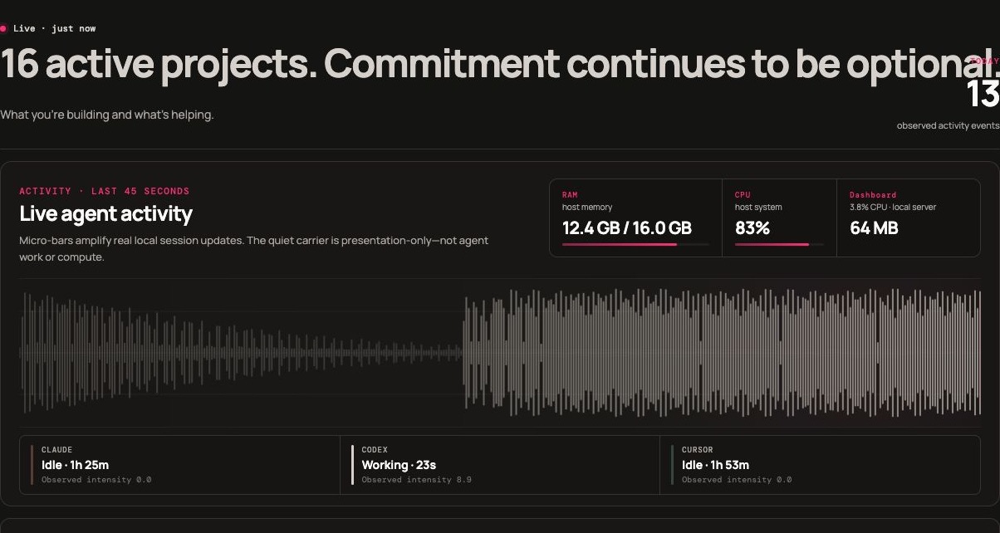

# AI Development Dashboard

A local-first, project-first desktop dashboard for understanding what AI resources contributed to a codebase: Git projects, Claude/Codex/Cursor sessions, observable consumption, installed capabilities, conservative maintenance signals, and privacy-safe recap stories.

> Private beta: this repository is prepared for a private remote. It is not yet a public product or hosted service.



## Why it exists

Modern development is often spread across more than one AI tool. This dashboard keeps the mental model simple: **Project → agents, sessions, capabilities, observable activity, and output**. It favors supported local evidence over attractive guesses; more tokens, LOC, prompts, or tool calls are never treated as proof of better work.

## Start

Requires Node 20+ and Git.

```bash
npm run scan
npm start
```

Open `http://127.0.0.1:4177`. The server binds only to loopback. It refreshes incrementally at startup and after local source changes; the small refresh control is only a fallback.

Project roots default to `~/Dropbox/Projects`. Override with `AI_DASHBOARD_PROJECTS_ROOT` (one path) or `AI_DASHBOARD_PROJECTS_ROOTS` (colon- or comma-separated), or write `projectsRoots` in `.dashboard-data/settings.json`.

## What V1 supports

- Finds Git repositories below configured project roots (default `~/Dropbox/Projects`; override with `AI_DASHBOARD_PROJECTS_ROOT` / `AI_DASHBOARD_PROJECTS_ROOTS` or `.dashboard-data/settings.json`).
- Reads observed metadata from `~/.claude/projects`, `~/.codex/sessions`, and `~/.cursor/projects` through isolated adapters. Model names are taken from later JSONL rows when the first record omits them.
- Attributes sessions to a project from recorded working directory, with visible confidence.
- Separates fresh input, output, cache-read and cache-creation token fields; it never labels their sum as subscription “tokens used.”
- Confirms capability use only from structured metadata and supports local-safe stack/manifest/private-inventory exports plus frozen share-card snapshots. Share previews stay in memory; only real exports persist `ShareSnapshot` files.
- Groups raw skill/plugin/command references into recognizable parent capabilities and keeps components available as an advanced audit view.
- Refreshes automatically at startup and after local source changes; the interface shows a subtle live/update state instead of making scanning a primary workflow.
- Reuses unchanged session summaries using source size + modification-time checkpoints; large transcripts are read only as bounded metadata prefixes.
- Discovers skills and instructions across user/project Claude, Codex and Cursor locations as capability references.
- Records cheap Git snapshots (branch, HEAD, dirty state, commit count) during scans. Full LOC walks are not part of the scan path.
- Presents Overview as an operator surface (Needs You, Continue Working, Start Here) plus Projects/detail, Capabilities/detail and Maintenance views.
- Builds metadata-only project handoffs and can open a project in Cursor or Codex when those CLIs are installed. Claude Code is reported unavailable when its CLI is missing.
- Keeps local-only project pins, statuses and concise working notes in a separate gitignored metadata store. They survive rescans and are never included in share/export assets.
- Separates Skills, Tools, Integrations and Instructions, with independent capability scope, artifact state and agent installation coverage. Maintenance emphasises broken/partial/duplicate items; unused capabilities stay collapsed. This dashboard does not install or sync skills.
- Opens Export Setup and Share Stats as toggleable utility drawers. Share Stats starts with a privacy-safe story, agent session-share marks and deterministic achievements before optional customization.
- Runs as a readable persistent desktop utility at common laptop and half-monitor window sizes. Overview puts resume and waiting-for-you above the live signal field, resources, and capacity.
- Builds a local Share Story deck: intro, ranked agent usage, projects/sessions, supported token profile, capability usage, and deterministic achievements appear only when evidence supports each slide. Export the current PNG, all available slide PNGs, or play a local review slideshow.

## Truth model

**Measured** means direct filesystem/Git/transcript metadata. **Confirmed** session attribution uses a recorded working directory below a discovered Git root. **Strongly inferred** identifies Cursor project folders with an encoded project path. **Unknown** stays unknown.

The dashboard never shows subscription quota/percentage, subscription billing, or invented productivity/cost. Token values are observable usage fields, not subscription charges. LOC and Git churn are descriptive—not measures of developer value.

## Privacy

No network request is made by the scanner or server. The generated `.dashboard-data/index.json` is local and gitignored. It contains source references, file fingerprints and derived counters only; raw conversations, prompt content, credentials and source code are not copied. Existing configurations/repositories are read-only.

Share Story uses a separate allowlisted snapshot. It excludes project names, project notes, paths, raw sessions, prompt/conversation text, credentials, secrets, and private capabilities. A public release must still receive a final history and screenshot audit; see [release checklist](docs/RELEASE-CHECKLIST.md).

## Metrics and limitations

Reliable now: session count, available usage fields, model if exposed, tool-call/context signals if exposed, Git metadata, capability installation/configuration references, and session/project confidence. Context signals are observations of `compact`/summary events, not a universal compaction metric.

Not reliable yet: Cursor token usage in this local record format, completed-task attribution, accepted changes, rework/reverts, subscription quotas, third-party update availability, and automated capability modification. The UI intentionally labels these gaps instead of manufacturing a score.

## Development

```bash
npm test
npm run scan
```

The tests use sanitized generated fixtures. See [environment audit](docs/ENVIRONMENT-AUDIT.md), [architecture](docs/ARCHITECTURE.md), [metrics](docs/METRICS.md), [sharing privacy](docs/SHARING-PRIVACY.md), [future benchmarks](docs/FUTURE-BENCHMARKS.md) and [reuse decisions](docs/REUSE-DECISIONS.md).

## Supported local sources

| Source | What is observed | Important limits |
| --- | --- | --- |
| Claude Code | Session metadata, supported token fields, structured skill attribution, local session-file activity | No supported local subscription percentage source is used. |
| Codex CLI | Session metadata, working-directory attribution, supported tool/context markers, local session-file activity | Token categories depend on what local records expose. |
| Cursor | Safe session presence, encoded project attribution, live WAL/`agent-tools` mtime | Local records do not currently support trustworthy token totals. Transcript files are often empty while an agent is working. |
| Git | Repository identity and descriptive change activity | LOC and churn are descriptive, not productivity scores. |

## Public-release notes

The project intentionally has no LICENSE yet: choose one deliberately before changing repository visibility. [CONTRIBUTING.md](CONTRIBUTING.md), [SECURITY.md](SECURITY.md), and [RELEASE-CHECKLIST.md](docs/RELEASE-CHECKLIST.md) are ready for that decision.
