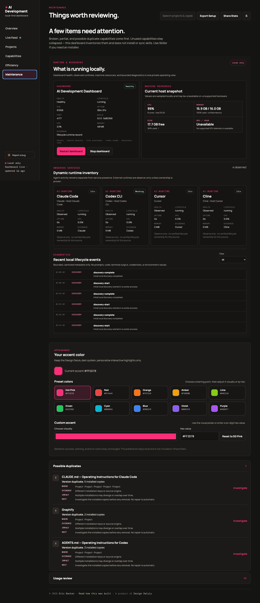

# AI Development Dashboard

AI Development Dashboard is a **local-first, project-first control center for AI-assisted development**. It observes supported local coding tools and explicitly connected sources, then organizes activity around projects, agents, hosts, providers, models, capabilities, capacity, usage, and defensible efficiency evidence.

It is not an AI model, orchestration runtime, model router, generic token counter, or skill marketplace.

[Repository](https://github.com/designdelulu/AI-Development-Dashboard) · [Documentation index](docs/README.md)


## Why use it?

- Resume project work with local handoff context instead of starting in a provider dashboard.
- See validated local runtime activity, plan capacity, and adaptive token activity without confusing installation with active work.
- Keep models, providers, hosts, gateways, and accounts distinct—even when a new model appears through an existing supported tool.
- Understand private efficiency evidence without a made-up “best model” score.
- Keep local scanning offline; connect OpenRouter only if you explicitly want its account telemetry.


## Quick Start

**Requirements:** Node.js 20 or newer, Git, and macOS for the currently validated experience. The server stays on `127.0.0.1`; Windows and Linux have not received the same end-to-end validation yet.

```bash
git clone https://github.com/designdelulu/AI-Development-Dashboard.git
cd AI-Development-Dashboard
npm run setup
ai-dashboard open
```

`npm run setup` checks Node, installs the dependencies from the committed lockfile, links the `ai-dashboard` command for your user, and checks lifecycle status. It does not use `sudo`, edit a shell profile, start a background service, configure an external agent, or contact a provider.

That is the complete first-run path. After setup, the normal commands are simply:

```bash
ai-dashboard open
ai-dashboard status
ai-dashboard stop
```

When the dashboard opens, it starts a localhost service, opens the browser, scans configured project roots, detects supported local tools and retained evidence, registers observed providers/models, and updates source lifecycle state. No provider account or sign-up is required for Local Core.

If `~/Dropbox/Projects` or `~/Projects` exists it is discovered; otherwise first run asks you to choose a project root. You can also set `AI_DASHBOARD_PROJECTS_ROOT` (one path) or `AI_DASHBOARD_PROJECTS_ROOTS` (colon- or comma-separated paths).

### Manual fallback

If setup cannot link the command, the equivalent manual path is:

```bash
npm install
npm link
ai-dashboard doctor
ai-dashboard open
```

## Everyday commands

```bash
ai-dashboard open      # start the owned local service and open the dashboard
ai-dashboard status    # inspect the owned service
ai-dashboard doctor    # run read-only lifecycle diagnostics
ai-dashboard stop      # stop only the owned dashboard service
ai-dashboard update    # update AI Development Dashboard itself
ai-dashboard report-bug # save a privacy-safe local report bundle
ai-dashboard cursor-hooks status # inspect optional high-fidelity Cursor telemetry
```

Run `ai-dashboard --help` for the complete lifecycle command list.

`update` updates the **dashboard only**. It does not update Claude, Codex, Cursor, Antigravity, OpenRouter models, skills, plugins, or capabilities. For a linked Git checkout it refuses dirty or diverged work, fetches only when you explicitly request it, fast-forwards only, and restarts only the dashboard service it owns.

If startup genuinely fails, `open` reports the sanitized failure category instead of waiting through a generic timeout. Run `ai-dashboard doctor` for local lifecycle state; the server also keeps a small bounded lifecycle log under `.dashboard-data/`.

## Discovery that keeps up

Every `ai-dashboard open` performs local discovery. While it is running, the dashboard watches known adapter roots and uses a bounded five-minute local fallback check. You do not normally need a rescan or restart.

| Situation | What happens |
| --- | --- |
| A new model appears through a supported tool | Its raw ID is preserved, normalized into the local identity registry, and appears in relevant usage surfaces automatically. |
| A supported tool is installed after startup | Local rediscovery notices it and updates its Installed/Historical/Active/Connected state when its adapter supports that evidence. |
| A completely unsupported tool or harness appears | It may need a future adapter before the dashboard can truthfully read sessions, tokens, or live work. No telemetry is guessed. |

Installation, historical use, active work, and connected status remain separate. An installed or open application is never treated as live agent activity without validated work evidence.


## Current support

| Source | Installed / historical discovery | Live work | Tokens / models | Capacity / cost | Notes |
| --- | --- | --- | --- | --- | --- |
| Claude Code | Supported | Validated JSONL growth | Supported where local fields exist | Optional documented local capacity status | Official Usage action remains available when Claude Code is closed; status/config touches never create live activity. |
| Codex CLI | Supported | Supported local session activity | Supported where local fields exist | Native local plan windows where exposed | Host and model remain separate. |
| Cursor | Supported | Supported structural agent-tool/transcript growth | Exact, Estimated, Mixed, or Unavailable local evidence | Capacity unavailable locally | Official Usage action remains available when Cursor is closed. App startup, editor storage, and WAL housekeeping are not AI activity; no browser/account scraping. |
| Cline | Feature-probed local/extension discovery, including Cline inside Cursor | Structured Cline session lifecycle when exposed | Exact local fields where session artifacts expose them; model IDs are dynamic | No Cline capacity source; OpenRouter account capacity remains separate | In Cursor, `Cline` is the agent and `Cursor` is the host. Provider, gateway, model, host, and project remain separate; extension/app presence alone is never AI activity. |
| Hermes Agent | Feature-probed local CLI/home/configuration and allowlisted structural session metadata | Current durable turn lease only; a running surface or session slot alone is not work | Exact local fields where Hermes exposes them; model IDs are dynamic | No Hermes cost/capacity claim; OpenRouter account analytics remains separate | Validated against Hermes Agent 0.20.6. The observed Desktop surface, OpenRouter gateway, underlying provider, and model stay distinct. |
| Ollama | Optional local adapter; documented loopback API only | Loaded-model state when `/api/ps` exposes it; no active-generation claim | Installed models, loaded model, size/quantization/context where exposed; API tokens unavailable | Local / no provider billing; no hardware-cost claim | The dashboard never changes Ollama configuration and never scans ports. |
| LM Studio | Optional local adapter when the `lms` CLI and documented loopback API are available | Loaded-model state when the API reports it; no active-generation claim | Installed/loaded model metadata, including quantization/context when exposed; API tokens unavailable | Local / no provider billing; no hardware-cost claim | The fixed documented local API is feature-probed; no generic OpenAI-compatible endpoint discovery. |
| Antigravity | Closed-app/CLI/root detection | Unavailable without validated work evidence | Optional documented local status-line snapshot | Optional quota bucket snapshot | Presence is not history or live work. |
| OpenRouter | Explicit Connected Service | Not a live agent | Provider-reported aggregate usage/models | Exact reported cost/credits where exposed | Disabled by default; project attribution stays Unknown without deterministic linkage. |
| Git | Project discovery | — | Descriptive repository activity | — | Not a productivity score. |
| VS Code | Extension/host discovery | — | — | — | Editor presence is not AI activity. |

### OpenRouter (optional)

OpenRouter is a connected **gateway/account telemetry source**, not a Live Agent. After explicit connection and manual sync, the dashboard uses `OPENROUTER_MANAGEMENT_KEY` from the dashboard process to request allowed analytics metadata, aggregate usage, and credits. It stores an opaque credential reference, never the key. Provider-reported cost is Exact only at the level OpenRouter reports and can be deterministically correlated; timestamp proximity never assigns remote requests to a project or local agent.

### Cline inside Cursor through OpenRouter (optional local agent)

Cline can run as an extension inside Cursor. In that configuration the normalized path is `Cline (agent) → Cursor (host) → OpenRouter (gateway) → underlying provider → exact model`, for example `Cline → Cursor → OpenRouter → Moonshot → Kimi`. Cline is not the only possible OpenRouter host: Claude Code, Codex, and future supported hosts may use the same gateway independently. The adapter discovers the real Cursor extension without requiring vanilla VS Code or a Cline CLI. Cline's inference key stays inside Cline and is never read or copied by the dashboard. The dashboard's separate `OPENROUTER_MANAGEMENT_KEY` is only for optional account analytics. A configured Cline model is not historical usage until a session artifact records observed work; remote OpenRouter rows remain host/project Unknown unless a deterministic correlation identifier is available.

### Cursor high-fidelity hooks (optional)

Cursor’s basic telemetry works automatically only when safe local structural evidence exists. For supported Cursor Agent workflows, you can explicitly enable higher-fidelity local activity using Cursor’s official command hooks:

```bash
ai-dashboard cursor-hooks status
ai-dashboard cursor-hooks install       # preview only
ai-dashboard cursor-hooks install --yes # explicitly install
ai-dashboard cursor-hooks remove        # preview only
ai-dashboard cursor-hooks remove --yes  # explicitly remove Dashboard entries
```

The installer preserves unrelated user hooks in `~/.cursor/hooks.json`, adds only namespaced Dashboard commands, creates a timestamped backup before a write, and never changes project, team, enterprise, Cline, or Claude hook configuration. It installs a small local bridge under `~/.cursor/hooks/`; Cursor reloads user hooks automatically.

Cursor passes JSON hook input to the bridge process. The bridge **does not parse or persist that input**: it drains stdin and records only its configured official event name and a timestamp in a bounded local queue. No prompts, thoughts, assistant responses, source code, file paths, terminal/shell commands, tool arguments/results, MCP payloads, email, credentials, or project paths are read or stored. `beforeSubmitPrompt` is the preferred turn start; a verified thought/tool/response callback also starts Working when Cursor omits that prompt callback for an Agent surface. Thought/tool/edit/shell/MCP/response hooks create real activity pulses; `stop` ends the turn as Recently Active. Long quiet model waits remain Working until `stop` or bounded orphan recovery. Without this opt-in integration, the existing privacy-safe transcript and presence fallback remains unchanged.

### Hermes Agent through OpenRouter (optional local agent)

Hermes is discovered from its own local installation and uses the normalized path `Hermes Agent (agent) → observed Hermes surface (host) → OpenRouter (gateway) → underlying provider → exact model`. A configured model is shown as configuration only; an observed Hermes session is required before it appears as historical model/token usage. The adapter reads a small allowlist from Hermes's canonical SQLite store—session lifecycle/route/project metadata and numeric token counters—and its current durable turn leases. It never reads messages, prompts, tool calls/results, memories, SOUL/USER files, `.env`, auth data, logs, or FTS/search tables. A current turn lease is the only Hermes Working signal; an open Desktop/TUI/CLI surface or an active session slot is not enough.

Hermes's own OpenRouter inference credential remains inside Hermes and is never read, copied, or displayed by the dashboard. The dashboard's optional `OPENROUTER_MANAGEMENT_KEY` remains a separate account-analytics connection. Local Hermes usage and account-level OpenRouter analytics stay separate unless a future source provides a deterministic shared request identifier; timestamp proximity is never used to merge or double-count them.

### Local models (optional)

Local inference support is adapter-based, currently feature-probing **Ollama** and **LM Studio** through their documented local interfaces only. It does not add dependencies, change runtime configuration, scan localhost ports, or transmit model inventory/state anywhere.

- **Installed** means the runtime returned a local model inventory. It is not usage history.
- **Loaded** means the runtime currently reports the model in memory.
- **Observed** means a supported agent session explicitly recorded work with that model; an installed or loaded model is never promoted to Observed automatically.
- **Active** is Unavailable today: these adapters do not claim that a loaded model is generating.

When an agent session provides route evidence, the identity is explicit—for example `Cline → Cursor → Ollama → qwen3:14b` is shown as **Local · Ollama**, with no OpenRouter gateway. Remote rows remain explicitly remote. Ollama may expose an exact runtime-reported model allocation (`size_vram`); this is displayed as model allocation only. Apple Silicon unified memory is never called VRAM, and per-model resource use remains Unavailable when the runtime does not expose it. Local API cost is shown as `Local / no provider billing`, not as free inference; power and hardware cost are outside the dashboard’s current scope.

### Antigravity (local foundation)

Antigravity can be found while closed from safe local installation evidence. Its optional documented status-line bridge requires a preview and explicit confirmation before changing its configuration. It can retain observed host, provider, model, workspace, context fields, and quota buckets when that source exposes them. Historical IDE telemetry is not fabricated, and an open app or refreshed quota does not create a live waveform.

## What the dashboard shows

- **Overview** — project-first resume context, handoff, and active work.
- **Live Feed** — dynamic 0…N local runtime lanes, token activity, capacity sources, and secondary system telemetry.
- **Projects** — canonical Git project inventory and private working memory.
- **Capabilities & Maintenance** — evidence-based inventory plus a private Runtime & Resources console for Dashboard health, observed runtime presence, local machine resources, bounded diagnostics, and safe Dashboard-only Restart/Stop controls; no generic process manager or automatic skill installation.
- **Efficiency** — private work-block/model/validator evidence and comparison cycles only when observations form defensible cohorts. No universal productivity score, leaderboard, or historical task fabrication.
- **Share Stats** — an allowlisted local share-story builder that excludes private project data, credentials, raw request IDs, and efficiency data.



Runtime & Resources is available under **Maintenance**. It shows the Dashboard build, health, uptime, local resource snapshot, observed runtimes, bounded diagnostics, and safe Dashboard-only Restart/Stop controls. It does not manage external agents or run arbitrary commands.

### Token Activity

The Token Activity meter is an adaptive **visual aid**. Its intensity uses Fresh + Output, while Cache Read, Cache Creation, and Observed token activity remain visible separately. Contributor bars are true selected-range observed-token shares, not intensity bars. Comparable completed local-day windows establish a recent P95 heavy range and a retained lifetime high, so ordinary activity does not permanently look maxed out. It never changes underlying totals, evidence labels, billing, or subscription usage. See [metrics](docs/METRICS.md#adaptive-token-activity-intensity).

### Appearance

The dashboard keeps its dark Design Delulu visual system and hot-pink default accent. In **Maintenance → Appearance**, choose one of ten clearly labeled presets, use the native visual color picker, or enter a validated custom hex color. The setting previews immediately, persists locally, and does not affect semantic success, warning, or error colors. Dashboard typography is tuned for comfortable laptop/desktop reading, with responsive fallbacks for mobile. The accent is not included in Share Stats.

## Privacy and security

**Local Core** (scanning, the localhost UI, local rediscovery, and local views) makes no network requests. It derives metadata locally and does not retain prompt bodies, source code, transcript bodies, terminal/test output, tool arguments, browser credentials, or provider keys. Optional Cursor Hooks receive JSON from Cursor at the bridge process, but the bridge drains and discards that stdin without parsing it; its bounded queue contains only the hook event name, timestamp, source marker, and schema version.

**Connected Services** are disabled by default. They make explicitly authorized requests only to the selected provider. OpenRouter is the current connected integration; it never receives prompts, code, or transcripts from the dashboard.

See [Privacy](PRIVACY.md), [Security](SECURITY.md), and [sharing privacy](docs/SHARING-PRIVACY.md).

## Troubleshooting

| Problem | What to do |
| --- | --- |
| `ai-dashboard: command not found` | Run `npm run setup`, or use the [manual fallback](#manual-fallback). |
| Dashboard may already be running | Run `ai-dashboard status`. |
| Stop the owned service | Run `ai-dashboard stop`. |
| Update refused because the Git tree is dirty | Commit or stash your own changes, then retry. The updater never overwrites them. |
| Port or lifecycle issue | Run `ai-dashboard status`, then `ai-dashboard doctor`. |

### Port already in use

The dashboard normally uses `127.0.0.1:4177`. `ai-dashboard doctor` identifies
whether that port contains a healthy dashboard, an orphaned dashboard, or an
unrelated local application. `ai-dashboard open` reuses a healthy owned
instance and safely recovers a verified orphan; it never kills an unrecognized
Node process or another development server. If another application owns the
port, stop or reconfigure that application and run `ai-dashboard open` again.
You do not need to inspect or kill a PID manually.

## Something went wrong?

When the dashboard is running, use **Report a bug** in the lower-left sidebar. Add a description, optionally choose one screenshot, review the report and sanitized diagnostics, and save a local report bundle before sharing it. On the public repository, the drawer also offers the GitHub issue form; opening it is always an explicit user action and screenshots remain manual attachments. Nothing is transmitted automatically and there is no report receiver configured by default.

When the dashboard will not open:

```bash
ai-dashboard doctor
ai-dashboard report-bug
```

`report-bug` works with the service stopped and stores a reviewable bundle under `.dashboard-data/bug-reports/`. It never includes prompts, transcript text, source code, terminal output, credentials, cookies, environment values, or private absolute paths. A future explicitly configured HTTPS receiver may accept a report only after an explicit submit; otherwise attach the local bundle manually.

Public issue forms: [report a bug](https://github.com/designdelulu/AI-Development-Dashboard/issues/new?template=bug_report.yml) · [request a feature](https://github.com/designdelulu/AI-Development-Dashboard/issues/new?template=feature_request.yml). Never paste API keys, prompts, private source code, or credentials into an issue.

## Documentation

Start with the [documentation index](docs/README.md). It links the current architecture, telemetry, metrics, adapters/integrations, privacy, security, efficiency semantics, contributing guidance, and release checklist. Planning documents are retained as planning context, not a promise that every planned integration is implemented.

## Development

```bash
npm test
npm run scan
npm start
```

This is an early public beta. It is MIT licensed ([LICENSE](LICENSE)). Contributions are welcome through the [contributor guide](CONTRIBUTING.md); the [security policy](SECURITY.md) and [privacy model](PRIVACY.md) explain the boundaries before you connect any service.
